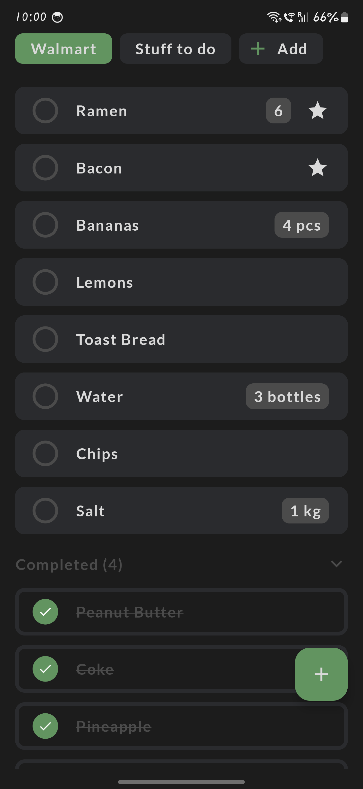
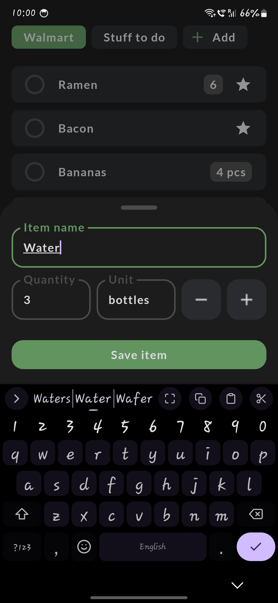
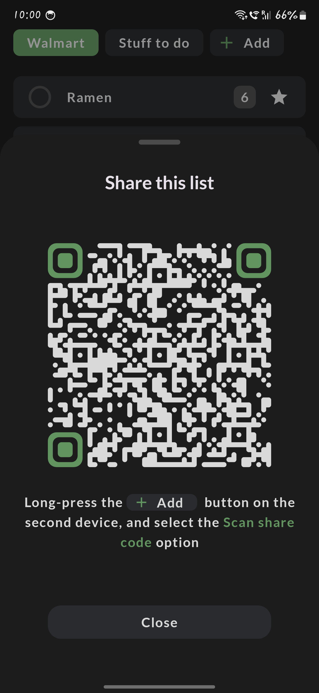

# Listflow
A simple, minimalistic and privacy-respecting shopping list / todo list app for Android. No ads, no telemetry, no paid subscriptions.

### What it does
Listflow is a straightforward list management app that focuses on being simple and effective:
- Create and manage multiple named lists
- Add, edit, check/uncheck, highlight items
- Optionally specify custom quantities for items
- Simple and intuitive interface
- Share lists with a second device, synchronize between devices (end-to-end encrypted)

### What it doesn't do
Listflow does **not** include:
- Ads
- Account creation requirements
- "Premium" features or any kind of subscription
- Analytics or any form of data collection
- Full-screen popups begging you to pay
- Any other useless bloat
- Backdoor to the encryption. Any demand from tyrannical governments to add it will be ignored.

This app was created as a form of protest against all the other "Shopping list" apps on the Play store, that are all seemingly trying to find increasingly more creative ways of violating your fundamental human right to privacy. Too much of our software today is tracking our every move, and selling the data to advertisers without our knowledge or consent, and something as simple as a shopping list should NOT be one of those apps.

## Screenshots

## Installation
The app is currently not being distributed on the Play Store, so the easiest way to get started is to grab the latest APK from the [Releases](../../releases) page and install it on your Android device.

Note: When installing, Android might warn you about installing apps from unknown sources. This is normal for apps not distributed through the Play Store. The app is open source, and you can verify the code yourself.

## Contributing

Feel free to:
- Submit pull requests
- Fork the project and make your own version
- Use the code in your own projects

## List sharing and synchronizing
This feature is implemented by using MQTT to transmit list updates between two devices. All communications besides the initial handshake are fully end-to-end encrypted using ECDH Key Derivation and AES encryption. Currently the app uses the `mqtt.eclipseprojects.io` public MQTT broker (hard-coded in [ListShareManager.kt](/app/src/main/java/com/firestormsw/listflow/data/viewmodel/ListShareManager.kt#L44)), but you can always self-host your own, fork this repo and change the broker URL. A more streamlined way of managing the broker URL might be added in the future.

## License

This project is licensed under the MIT License - see the [LICENSE](LICENSE) file for details. In simple terms: do whatever you want with it.
